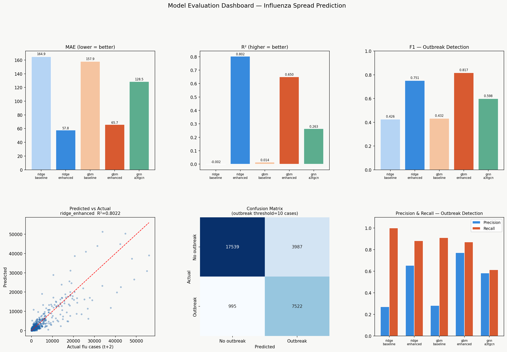
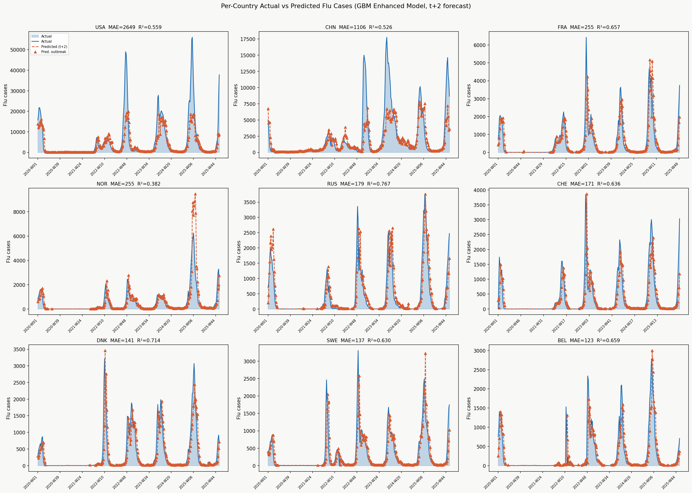
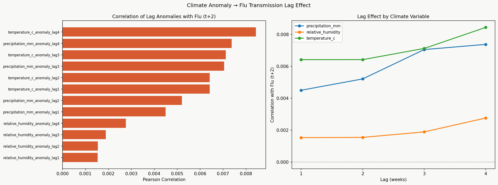
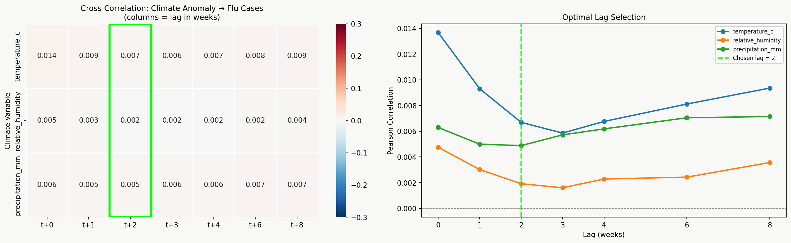
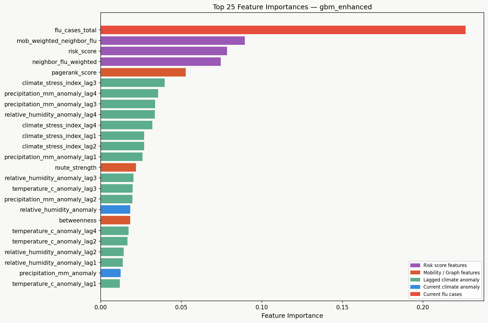
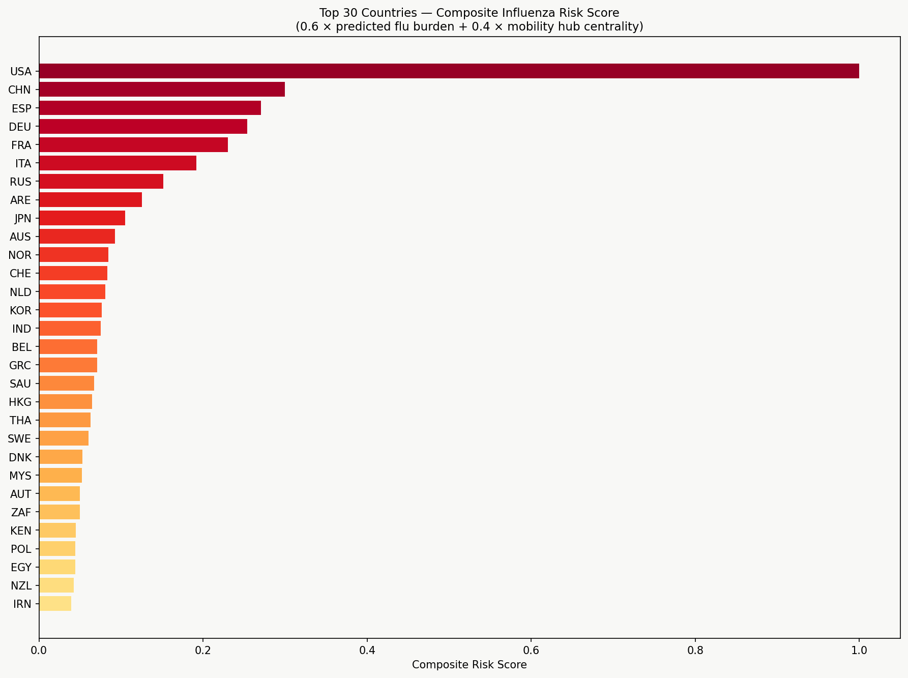
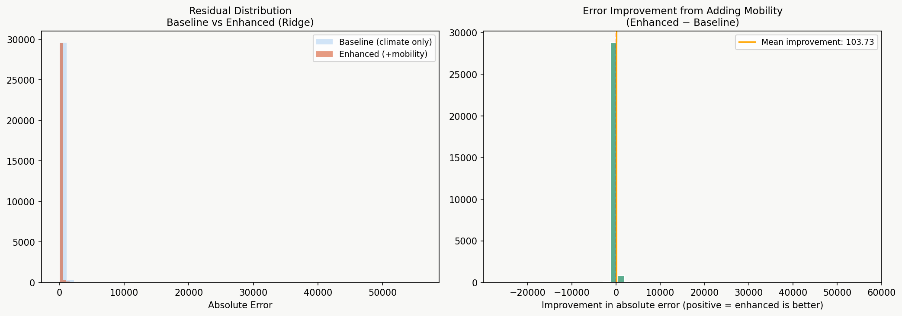

# Module 4 — Prediction Modeling & Evaluation

**Goal:** forecast national influenza burden **two weeks ahead** (`flu_cases` at *t+2*) for every country, then turn those forecasts into an outbreak‑detection signal and a country risk ranking. Three model families are trained on one shared split and ranked on a single common metric, and the best model by validation RMSE is deployed.

**Notebook:** [`module4_modeling.ipynb`](module4_modeling.ipynb) · **Artifacts:** [`Module4_output/`](Module4_output/)

---

## 1. Inputs & Master Feature Table

Module 4 consumes the outputs of the upstream modules and joins them on `(country_iso3, year, week)`:

| Source | Provides |
| :--- | :--- |
| `climate_anomaly_features.parquet` | temperature / humidity / precipitation anomalies + lags 1–4, climate‑stress index |
| `flunet_clean.parquet` | weekly influenza case counts (the prediction target) |
| `mobility_features.parquet` | mobility‑weighted neighbour flu, risk score |
| `graph_metrics.parquet` | PageRank, TSPR, betweenness, degree centrality, route strength |
| `mobility_edges.parquet` | airline route edges — the graph used by the GNN |

**Master table:** 89,980 rows · 119 countries · weeks spanning 2001–2025.
**Target:** `flu_target_t2` = `flu_cases_total` shifted **−2 weeks** (predict 2 weeks ahead).

Two feature sets are defined so the value of the network/mobility layer can be isolated:

* **Baseline (19 features)** — climate anomalies + lags + climate‑stress index only.
* **Enhanced (28 features)** — baseline **plus** the autoregressive flu term (`flu_cases_total`), mobility‑weighted neighbour flu, graph centralities (PageRank/TSPR/betweenness/degree/route strength), and risk scores.

**Split (temporal, no leakage):** `train < 2018` | `val 2018–2019` | `test ≥ 2020`. A `StandardScaler` is fit on **train years only** and applied to all splits. The same split, target, and metrics are reused by the GNN so all three models are directly comparable.

---

## 2. Models

| Model | Form | Selection |
| :--- | :--- | :--- |
| **Ridge** | L2‑regularized linear regression | best of `alpha ∈ {0.1, 1, 5, 10}` by val RMSE |
| **Gradient Boosting** | XGBoost if available, else sklearn GBM | best of 3 depth/lr/subsample configs |
| **A3T‑GCN** | Spatio‑temporal GNN: message passing over the airline graph + GRU/temporal attention | early stopping on val RMSE |

Each tabular model selects its best config on the validation split, refits on train+val, and is scored **once** on the test set. The boosting pipeline was subsequently upgraded to train on `log1p(counts)` with early stopping (see §7).

**A3T‑GCN specifics:** look‑back window `L = 8` weeks → predict `t+2`; `HuberLoss(delta=1.0)` + Adam (`lr=1e-2`); ~9.3k parameters. Absent country‑weeks (~42 % of the dense `(T, N, F)` grid) are handled with an **observed‑mask channel** (literal‑`0` features + an indicator) rather than dropping graph edges; the graph is static (per‑snapshot edge pruning was tested and hurt). It early‑stopped at epoch 69 (best val RMSE 561.4).

---

## 3. Leaderboard

All metrics are computed in raw case‑count units. Sorted by validation RMSE (the deployment criterion):

| Model | Val RMSE | MAE | Test RMSE | $R^2$ | F1 |
| :--- | ---: | ---: | ---: | ---: | ---: |
| **ridge_enhanced** 🏆 | **301.6** | **57.8** | **552.4** | **0.802** | 0.751 |
| gbm_enhanced (XGBoost) | 324.1 | 65.7 | 734.9 | 0.650 | **0.817** |
| gnn_a3tgcn (A3T‑GCN) | 561.4 | 128.5 | 1034.8 | 0.263 | 0.598 |
| gbm_baseline | 804.7 | 157.9 | 1198.9 | 0.014 | 0.432 |
| ridge_baseline | 808.5 | 164.9 | 1208.2 | −0.002 | 0.426 |

**Deployed:** `ridge_enhanced` (28 features) → [`flu_model.pkl`](Module4_output/flu_model.pkl), [`final_results.parquet`](Module4_output/final_results.parquet) (89,980 rows, 119 countries).

---

## 4. Result Plots

### 4.1 Model Dashboard

Six‑panel summary: MAE, $R^2$, and F1 bars across all five models, plus the `ridge_enhanced` predicted‑vs‑actual scatter, its outbreak confusion matrix (TN 17,539 · FP 3,987 · FN 995 · TP 7,522), and per‑model precision/recall. The enhanced models tower over the climate‑only baselines; Ridge leads on regression, XGBoost on outbreak F1.

### 4.2 Per‑Country Predictions

Actual vs predicted `t+2` flu for the nine highest‑burden countries, with predicted outbreak weeks flagged. Shows where the deployed model tracks seasonal peaks and where it lags sharp onsets.

### 4.3 Lag Effect Analysis

Correlation of lagged climate anomalies with flu at `t+2`. The strongest per‑variable correlations are tiny (|r| ≈ 0.008 at lag 4) — climate anomalies, on their own, carry almost no linear signal for this target.

### 4.4 Cross‑Correlation Heatmap

Climate→flu correlation swept across lags `t+0 … t+8` to justify the forecast horizon. Optimal lag is ~`t+0` with mean |r| ≈ 0.008 — confirming the weak, diffuse climate coupling seen in 4.3.

### 4.5 Feature Importance (XGBoost Enhanced)

Importance by category: **Lag climate 39.6 %**, Risk score 24.7 %, Current flu 23.1 %, Mobility/Graph 18.6 %, Current climate 3.1 %. The split between this and the near‑zero climate *correlations* in 4.3–4.4 is discussed in §7.

### 4.6 Country Risk Ranking

Composite risk = `0.6 × predicted flu burden + 0.4 × mobility‑hub centrality`, refit on all data to score the next 2 weeks. Top of the ranking: USA, CHN, ESP, DEU, FRA, ITA, RUS — large‑burden, high‑connectivity hubs. Exported to [`country_risk_scores.parquet`](Module4_output/country_risk_scores.parquet).

### 4.7 Baseline vs Enhanced Improvement

Adding the mobility/graph/autoregressive layer beats the climate‑only baseline on **91.2 %** of test records, for a mean error reduction of **103.7 cases**.

---

## 5. Interpretation — Why the Results Look the Way They Do

This is the section that matters: the leaderboard is counter‑intuitive, and the *reasons* are more informative than the numbers.

### 5.1 The enhanced jump is the whole story — and it is not climate
Every model leaps from near‑useless to strong **only** when the enhanced features are added: Ridge goes from $R^2 = -0.002$ (baseline) to **0.802** (enhanced). The lag plots (4.3, 4.4) show why the baseline is hopeless — climate anomalies correlate with flu at |r| ≈ 0.008, i.e. essentially noise. The lift comes almost entirely from the **autoregressive term** (`flu_cases_total` at *t* predicting *t+2*) plus the mobility/risk features. In plain terms: *the best predictor of flu in two weeks is flu right now, propagated along mobility links* — not the weather.

### 5.2 The climate‑importance paradox
Feature importance (4.5) credits **lag climate with 39.6 %**, yet those same lags correlate near‑zero with the target (4.3). These are not contradictory — they expose how tree importance behaves. There are 16 climate‑lag columns; a boosted tree makes many low‑value splits across them, and impurity‑based importance *accumulates* over all those splits even when each contributes little real signal. The honest reading: climate's apparent 39.6 % is largely **split‑count inflation across many weak, collinear columns**, not genuine predictive power — consistent with the fact that climate‑only models score $R^2 ≈ 0$. Treat that bar as a caution about impurity importance, not as evidence that weather drives the forecast.

### 5.3 Why a linear model tops both XGBoost and the GNN
1. **The features were engineered to be linear.** The lag‑anomalies were selected by *Pearson correlation* and the dominant signal is an autoregressive level — a setup where a linear estimator is the matched tool and extracts the signal with no excess variance.
2. **Only Ridge extrapolates through the regime shift.** The test set (≥2020) is the COVID era, where flu counts collapse *below* the pre‑2018 training range. Trees and the GNN can only emit values near their training range — they cannot extrapolate — while Ridge extends its linear response and degrades gracefully. This is why Ridge's edge is widest on **RMSE** (552 vs 735 vs 1035): RMSE punishes exactly the large regime‑shift misses.
3. **Bias–variance favours simplicity.** Modest data + near‑linear signal means the low‑variance model generalizes best; boosting and especially the GNN overfit pre‑COVID structure and transfer worse across the 2020 break.

### 5.4 Why the A3T‑GCN falls short despite being the most sophisticated
* **Sparsity tax:** ~42 % of the grid is absent; message passing averages real signal with masked‑zero placeholders. The tabular models simply drop those rows and never pay this cost.
* **Static graph fights the test era:** edges are fixed airline routes, but air mobility collapsed in 2020+. The GNN keeps diffusing flu along routes that were shut — its core assumption is most wrong exactly where it is scored.
* **Diluted signal:** the autoregressive term that Ridge/XGBoost use raw is scaled → masked → message‑passed → pushed through a GRU in the GNN, attenuating the very feature that carries the forecast.
* **Capacity vs reward:** with a near‑linear dominant relationship and ~58k training rows, the GNN spends parameters modeling spatial diffusion the data barely rewards, and its noisy validation curve reflects a much harder optimization than a closed‑form ridge solve. Result: highest MAE (128.5) and RMSE (1034.8) of the enhanced models.

### 5.5 The leaderboard is not one‑dimensional
Ridge does **not** win everything. **XGBoost takes outbreak‑detection F1 (0.817 vs 0.751)**: when the task is reframed from "predict the count" to "flag the threshold crossing," the trees' decision‑boundary flexibility pays off. The GNN's contribution is **methodological** — a defensible spatio‑temporal formulation that should overtake the tabular models given denser per‑country reporting and a *dynamic* graph tracking the 2020 mobility collapse. The verdict: **regression accuracy under regime shift rewards the simplest model; outbreak classification rewards the trees.** `ridge_enhanced` is deployed because validation RMSE is the project's primary metric — not because it is universally best.

### 5.6 Deployment, limitations & next steps
* **Deployed:** `ridge_enhanced` → `flu_model.pkl`; predictions and risk scores exported for the dashboard.
* **Limitations:** weak climate coupling (the module's climate features add little); a static graph and a frozen pre‑2018 training window that never adapts to 2020+; impurity‑based importance that overstates climate.
* **Highest‑leverage improvements:** (1) train boosting on `log1p` with a count objective (Poisson/Tweedie) — partially applied; (2) **walk‑forward retraining** so the model adapts to the regime instead of being judged frozen; (3) a **stacking ensemble** of Ridge (regression‑strong) + XGBoost (F1‑strong) + GNN; (4) a **dynamic mobility graph** for the GNN. Items (1)–(2) target the COVID‑era extrapolation failure directly; (3) exploits the fact that the three models win on different metrics.

> **Note on reproduced numbers:** the figures above reflect the artifacts currently in `Module4_output/`. The boosting pipeline was later upgraded to `log1p` target + early stopping; re‑running the notebook may shift the XGBoost row (and possibly the ranking). Re‑run on Kaggle to refresh the dashboard before final submission.
